# 🚀 AI Learning Roadmap: The Path to AGI

> "First principles thinking is the only way to build the future. Stop copying, start building." — AI Learning Community

Welcome to the ultimate, hardcore roadmap for mastering Artificial Intelligence. This isn't just a collection of links; it's a mission-critical guide to understanding the physics of intelligence and building the future of AGI.

---

## 🌐 [Read the Full Guide Online](https://wendellhua.github.io/AI-Learning-Roadmap/)

---

## 🛠️ The Mission Architecture | 任务架构

We don't do "shallow learning." We follow **First Principles**.

```mermaid
graph TD
    A[00. Physics of Math] --> B[01. Silicon & Hardware]
    B --> C[02. The Transformer Core]
    C --> D[03. Local Intelligence]
    D --> E[04. Prompt Engineering]
    E --> F[05. RAG & Fine-tuning]
    F --> G[06. AI Agents & Autonomy]
    G --> H[07. Safety & Alignment]
    H --> I[🚀 AGI Ready]
```

### 🔭 Why This Roadmap?
1. **Hardcore Foundation**: From Linear Algebra to CUDA.
2. **AI-Native Workflow**: Use AI to learn AI. 
3. **Global Deployment**: Real-world strategies for shipping globally.
4. **Bilingual Support**: Built-in TTS for English and Chinese.

---

## 🧪 Hardcore Lab | 实验室
*Stop reading, start shipping.* Check out our [Hardcore Lab](./docs/lab/index.md) for:
- One-click Model Quantization
- RAG Pipeline Blueprints
- Multi-Agent Orchestration Scripts

---

## 🔊 Accessibility
Click the **"Listen 🔊"** button on any page to activate our custom-built TTS engine. Perfect for learning while commuting or for visually impaired engineers.

---

## 🛰️ How to Join the Mission
1. **Star** this repo to stay updated.
2. **Fork** to customize your learning path.
3. **Contribute**: Found a better way to optimize a prompt or a model? Open a PR.

---

## ⚠️ Disclaimer
This is a high-performance learning resource. It requires a "First Principles" mindset. If you are looking for shortcuts, this is not for you.

---

> 🚀 **"The future is built by those who understand how it works."**

