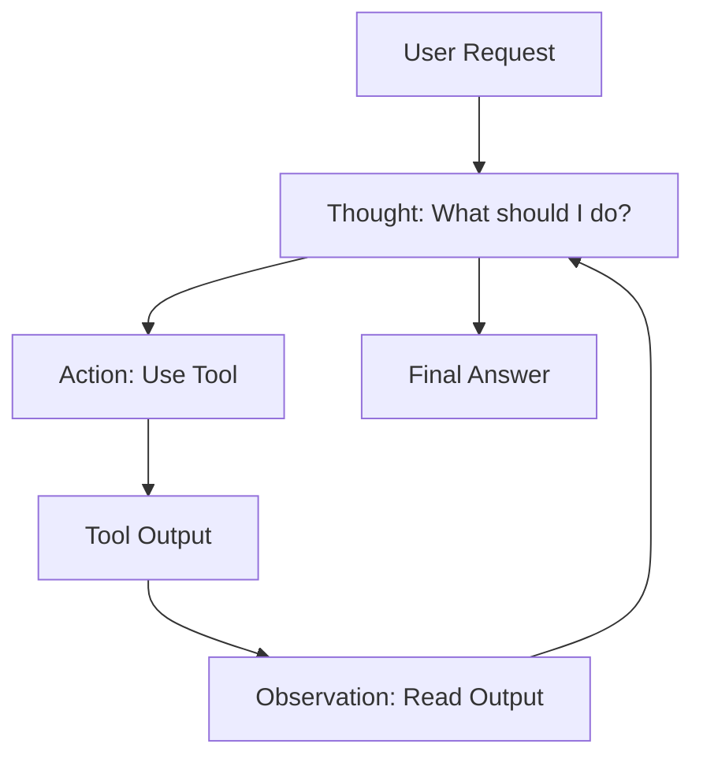

# Agent Frameworks: Assemble Your Team | Agent 框架：组建你的战队

> **The Mission**
> You are the Commander (Nick Fury). You need to assemble a team of superheroes (Agents) to save the world (Complete a Task).
> **任务**
> 你是指挥官（尼克·弗瑞）。你需要组建一支超级英雄战队（Agent）来拯救世界（完成任务）。
> 你应该用哪个框架来管理他们？

## 1. The Three Frameworks | 三大框架

### 1.1 LangChain: The Iron Man Lab (钢铁侠实验室)
- **Analogy**: You have a garage full of parts (Chains, Prompts, Tools). You build your own suit from scratch.
- **Pros**: You can build *anything*. A flying suit? A tank? A toaster? Yes.
- **Cons**: It's complicated. You need to be an engineer like Tony Stark.
- **Best For**: **Inventors** who want total control.

### 1.2 CrewAI: The Avengers Team (复仇者联盟)
- **Analogy**: You have a team of specialists.
    - **Hulk**: Smash things (Heavy tasks).
    - **Black Widow**: Spy (Research).
    - **Captain America**: Leader (Manager).
- **Pros**: Everyone knows their role. They work together smoothly.
- **Cons**: Hard to make Hulk do spy work (Rigid roles).
- **Best For**: **Managers** who want a reliable workflow.

### 1.3 AutoGen: The Round Table (圆桌会议)
- **Analogy**: You put a bunch of geniuses in a room and let them talk.
    - **User Proxy**: "I want a snake game."
    - **Coder Agent**: "Here is the Python code."
    - **Reviewer Agent**: "Wait, there is a bug. Fix it."
    - **Coder Agent**: "Fixed. Try again."
- **Pros**: They can fix their own mistakes!
- **Cons**: Sometimes they argue forever and nothing gets done.
- **Best For**: **Coders** and **Problem Solvers**.

## 2. How Agents "Think": The ReAct Loop | Agent 如何“思考”：ReAct 循环

How does an Agent actually do stuff? It uses a magic spell called **ReAct** (Reason + Act).
Agent 到底是怎么做事的？它使用一种叫 **ReAct**（推理 + 行动）的魔法咒语。

1.  **Thought (思考)**: "The user wants the weather in Tokyo. I don't know it."
2.  **Action (行动)**: "I will use the `Google Search` tool."
3.  **Observation (观察)**: "Google says it is 25°C and sunny."
4.  **Thought (思考)**: "Now I have the answer."
5.  **Final Answer (最终答案)**: "It is 25°C in Tokyo."



## 3. Code Battle: CrewAI Example | 代码对决：CrewAI 示例

Let's build a mini news team.
让我们建立一个迷你新闻团队。

```python
from crewai import Agent, Task, Crew

# 1. The Scout (侦察兵)
# He finds the enemies (news).
researcher = Agent(
    role='Scout',
    goal='Find news about AI',
    backstory='You are a fast scout who reads everything.'
)

# 2. The Bard (吟游诗人)
# He tells the story.
writer = Agent(
    role='Bard',
    goal='Write a legend',
    backstory='You write epic stories about technology.'
)

# 3. The Mission (任务)
task1 = Task(description='Find 3 AI trends', agent=researcher)
task2 = Task(description='Write a blog post', agent=writer)

# 4. Assemble! (集结！)
crew = Crew(agents=[researcher, writer], tasks=[task1, task2])
crew.kickoff()
```

## 4. Scientist's Corner | 科学家角落

> **The Challenge of Planning**
> Humans are great at planning ("I will go to the store, THEN cook dinner").
> LLMs are bad at long-term planning. They tend to get distracted.
> **Agentic Workflows** (like LangGraph) try to fix this by forcing the model to follow a strict map (State Machine), so it doesn't get lost.
> **规划的挑战**
> 人类擅长规划（“我会去商店，然后做晚饭”）。
> LLM 不擅长长期规划。它们容易分心。
> **代理工作流**（如 LangGraph）试图通过强迫模型遵循严格的地图（状态机）来解决这个问题，这样它就不会迷路。

## 5. Practice Mission: Design Your Squad | 练习任务：设计你的战队

**Objective (目标)**: Design a multi-agent team to solve a complex problem.
**目标**：设计一个多智能体团队来解决一个复杂问题。

**Scenario (场景)**:
You want to create an **"AI Travel Agency"**.
The user says: "Plan a 3-day trip to Kyoto for me. I like temples and sushi."
你想创建一个**“AI 旅行社”**。
用户说：“帮我计划一个去京都的 3 天旅行。我喜欢寺庙和寿司。”

**Task (任务)**:
Define the roles for 3 Agents.
为 3 个 Agent 定义角色。

1.  **Agent 1 (The Planner)**:
    *   **Role**: ?
    *   **Goal**: ?
    *   **Tools**: ? (e.g., Calendar, Map)
2.  **Agent 2 (The Researcher)**:
    *   **Role**: ?
    *   **Goal**: ?
    *   **Tools**: ? (e.g., Google Search, TripAdvisor)
3.  **Agent 3 (The Concierge)**:
    *   **Role**: ?
    *   **Goal**: ?
    *   **Tools**: ? (e.g., Booking.com API)

**Workflow (工作流)**:
Draw a simple arrow diagram of who talks to whom.
画一个简单的箭头图，说明谁跟谁说话。
*   User -> Agent 1 -> Agent 2 ... ?

> **Example Answer (参考答案)**:
> 1.  **Agent 1 (Manager)**: Breaks down the request. "Day 1: Temples. Day 2: Sushi."
> 2.  **Agent 2 (Researcher)**: Finds the best temples (Kinkaku-ji) and sushi places (Sushiro).
> 3.  **Agent 3 (Writer)**: Compiles the itinerary into a nice PDF.
>
> **Flow**: User -> Manager -> Researcher -> Manager -> Writer -> User.
