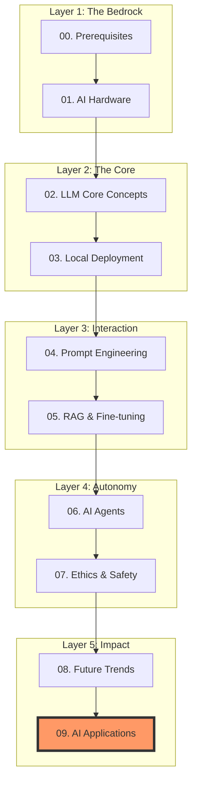

# 🚀 AI Learning Roadmap: The Path to AGI

> "The best way to predict the future is to invent it." — Alan Kay (and every AGI researcher)

Welcome to the **hardcore** mission to master Artificial Intelligence. This roadmap is designed with a **First Principles** approach, stripping away the noise to focus on the fundamental physics of intelligence and its practical application.

---

## 🗺️ Mission Architecture | 任务地图

The roadmap is structured into logical layers, moving from silicon to intelligence.

---

## 📚 Mission Syllabus | 任务大纲

### 🏗️ [Hardcore Lab | 实验室](./lab/index.md)
**Stop reading, start shipping.** Direct access to scripts, templates, and executable experiments.

### 📐 [00. Prerequisites | 预备知识](./00_Prerequisites/index.md)
- **Mathematics**: Linear Algebra, Calculus, Probability. The language of AI.
- **Fundamentals**: How neural networks actually function.

### 🔧 [01. AI Foundations & Hardware | AI 基础与硬件](./01_AI_Foundations_and_Hardware/index.md)
- **Global Landscape**: Who owns the compute?
- **Local Choice**: Building your own AI workstation.

### 🧠 [02. LLM Core Concepts | 大模型核心概念](./02_LLM_Core_Concepts/index.md)
- **Transformer Deep Dive**: The architecture that changed everything.
- **Emergence**: Understanding how scale creates intelligence.

### 💻 [03. Local Deployment & Quantization | 本地部署与量化](./03_Local_Deployment_and_Quantization/index.md)
- **Ollama**: Running high-performance models locally.
- **Quantization**: Fitting a giant brain into a small box.

### ✍️ [04. Prompt Engineering | 提示工程](./04_Prompt_Engineering/index.md)
- **System Prompts**: The hidden code behind Cursor and v0.
- **Advanced Techniques**: CoT, ToT, and ReAct.

### 🔍 [05. RAG & Fine-tuning | RAG 与微调](./05_RAG_and_Fine_tuning/index.md)
- **RAG**: Giving AI a long-term memory.
- **Fine-tuning**: Specialized training for specialized tasks.

### 🤖 [06. AI Agent Development | AI 智能体开发](./06_AI_Agent_Development/index.md)
- **Frameworks**: LangChain vs. AutoGen vs. CrewAI.
- **Autonomy**: Building systems that think and act.

### 🛡️ [07. AI Ethics & Safety | AI 伦理与安全](./07_AI_Ethics_and_Safety/index.md)
- **Alignment**: Ensuring AI goals match human values.
- **Defense**: Protecting against prompt injection.

### 🚀 [08. Future Trends | 未来趋势](./08_Future_Trends/index.md)
- **Embodied AI**: When AI gets a physical body.
- **World Models**: Predictive intelligence.

### 🎯 [09. AI Applications Learning | AI 应用学习](./09_AI_Applications_Learning/index.md)
- **Coding Mastery**: Becoming an AI-augmented developer.
- **Global Deployment**: Shipping your AI app to the world.

---

## 🔊 Accessibility

This site features a custom **Bilingual Text-to-Speech (TTS)** engine. Click the 🔊 button on any page to listen. We believe intelligence should be accessible to everyone.

---

> 🚀 **"The future is not something that happens to us. It's something we create."**

